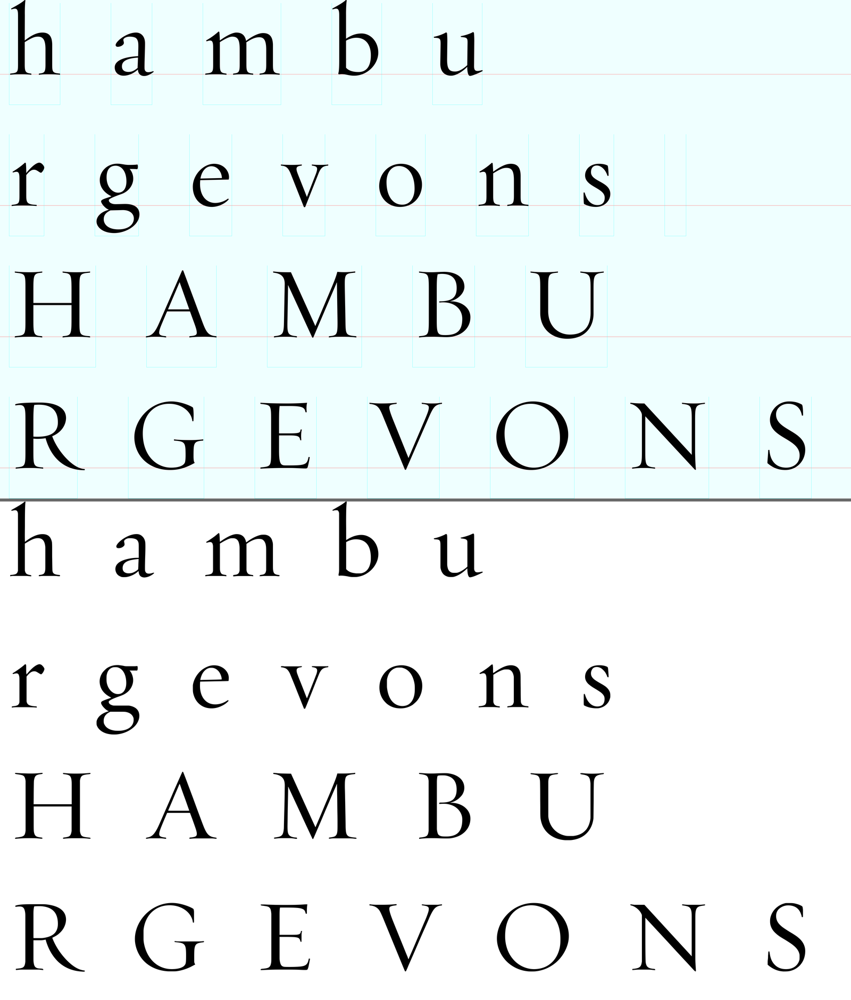
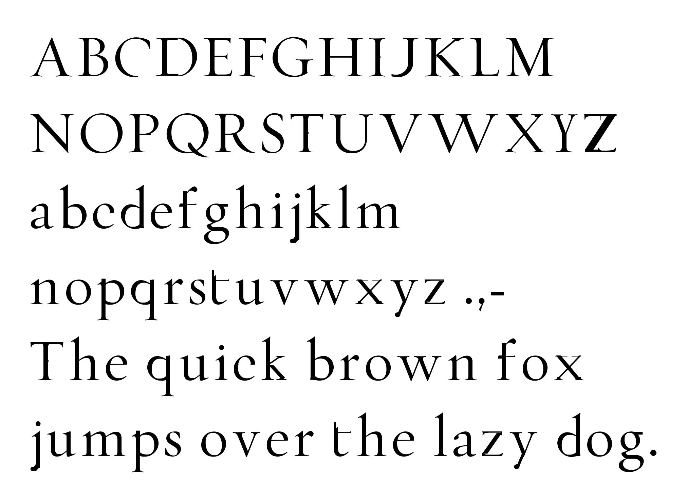

# VibeFont

Computer, make font.

A pipeline for making fonts with AI: draw a sample sheet, and it segments the
rows, traces every glyph to vector outlines, derives the letters the sample
doesn't cover from traced parts, and compiles an installable TTF with
[fonttools](https://github.com/fonttools/fonttools) — plus proof and
comparison renders to judge the result by.

## Sample

24 drawn glyphs in, 55 glyphs out. The four `hamburgevons` rows below carry
every structural part of the alphabet; the other 31 characters (c d f i j k l
p q t w x y z, their capitals, and `.,-`) are assembled from traced pieces —
stems from h/n, bowls from o/b, diagonals from v/V, arms from r/E.

Source sheet above, the built font re-rendering it below:



The full character set, typed with the font's own metrics:



The font itself: [`assets/samples/VibeSerif-Regular.ttf`](assets/samples/VibeSerif-Regular.ttf)
— download and double-click to install.

## Quick start

Requires [uv](https://docs.astral.sh/uv/) (which fetches Python ≥ 3.12 itself).

```sh
git clone https://github.com/4esv/VibeFont.git && cd VibeFont
uv sync
uv run pytest   # toolchain + end-to-end pipeline tests
uv run vibefont assets/input/font-sample.png \
  --line hambu --line rgevons --line HAMBU --line RGEVONS
```

Outputs land in `assets/output/`: the TTF, a proof sheet, and a side-by-side
comparison against the source image.

## Your own font

Draw a sample sheet that follows four rules:

1. **Ink is near-black** (every RGB channel < 128). Guides — baselines,
   grids, zone strips — are light or colored, so they never read as ink.
2. **Rows** are separated by clear horizontal gaps; descenders must not touch
   the next row.
3. **Glyphs** within a row are separated by clear vertical gaps; no touching
   letters.
4. A colored baseline guide under each row is used if present; otherwise the
   median glyph bottom is.

Then run it, one `--line` per row, text exactly as drawn:

```sh
uv run vibefont my-sample.png --line hambu --line rgevons \
  --line HAMBU --line RGEVONS --family "My Serif"
```

More letters on the sheet means fewer derived ones. Letters the sheet doesn't
cover come from recipes in [`src/vibefont/recipes.py`](src/vibefont/recipes.py)
— per-letter assembly instructions tuned against proof renders. They are
design decisions, not derivations, and they are where the iteration happens.

## Making fonts with AI

This repo ships two [Claude Code](https://claude.com/claude-code) skills, so
the intended workflow is conversational:

```sh
cd VibeFont && claude
> make a font from ~/Desktop/my-sample.png — rows are "hambu", "rgevons", ...
> the derived k looks too wide and its arm misses the stem — fix it
```

- **make-font** — runs the pipeline, reads the proof/comparison renders,
  reports traced vs derived, diagnoses segmentation failures.
- **glyph-recipes** — writes and tunes derivation recipes: the parts toolkit,
  the coordinate system, and the craft rules (cut serif slabs shallow, never
  rotate serifed strokes, overlap joins generously...).

Everything in this repo — pipeline, recipes, the sample font above — was
built that way.

## How it works

```
image ──► segment (rows, glyph boxes, baselines)
              ├──► trace (potrace: bitmap → cubic contours, px → font units)
              └──► derive (cut parts, compose missing letters, retrace)
                       ▼
          build (fonttools: cu2qu, metrics, name records, overlap removal) ──► TTF
                       ▼
          render (proof, recreation, comparison sheets)
```

| module       | role                                                          |
|--------------|---------------------------------------------------------------|
| `segment.py` | ink mask, row bands, per-glyph boxes, baseline detection      |
| `trace.py`   | potrace each glyph crop into baseline-anchored outlines       |
| `derive.py`  | bitmap parts toolkit: cut, flip, scale, 3-slice stretch, paste|
| `recipes.py` | per-letter assembly instructions for the 31 derived glyphs    |
| `build.py`   | FontBuilder: glyf, metrics, OS/2, full name-record set, gasp  |
| `render.py`  | proof sheet, sample recreation, side-by-side comparison       |

Derived glyphs are composed as bitmaps and retraced like drawn ones, so paste
seams merge into clean outlines. The TTF carries the full name-record set,
code-page bits, and fsSelection flags that macOS Font Book validation
requires — it installs cleanly.

## Layout

```
src/vibefont/     package + CLI
tests/            toolchain smoke tests + end-to-end pipeline test
assets/input/     source sample sheets
assets/output/    build target (gitignored)
assets/samples/   tracked results: TTF, proof, comparison
.claude/skills/   Claude Code skills: make-font, glyph-recipes
```

## Toolchain

| dep          | role                                        |
|--------------|---------------------------------------------|
| fonttools    | font compilation, pens, cu2qu, name tables  |
| skia-pathops | overlap removal / path booleans             |
| potracer     | bitmap → vector tracing (pure Python)       |
| Pillow       | image loading + rendering                   |
| numpy        | bitmap buffers between Pillow and potrace   |

MIT licensed.
